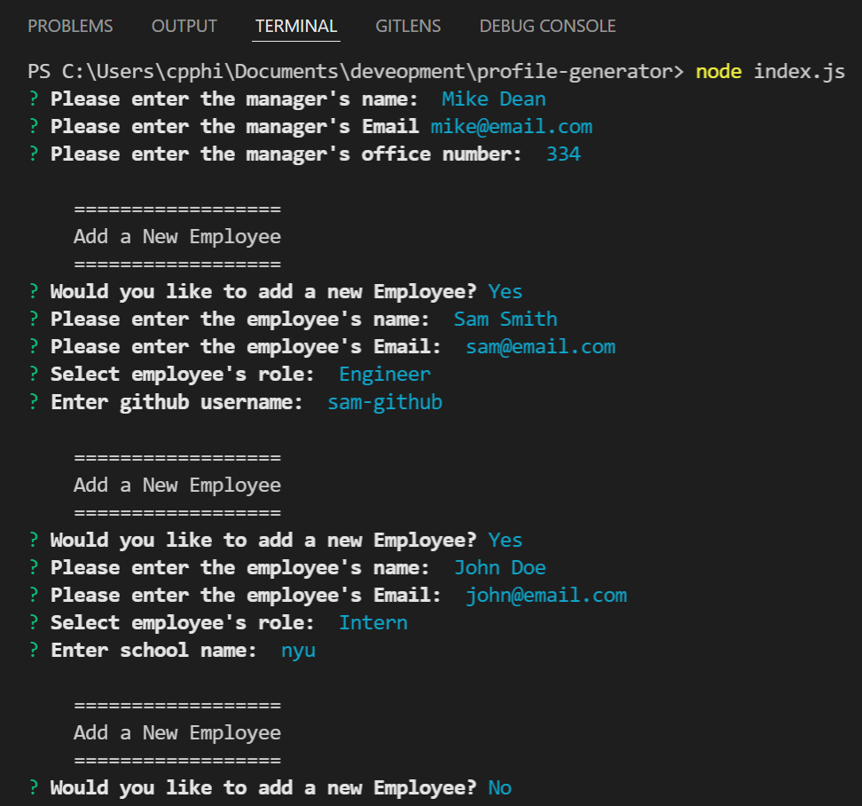
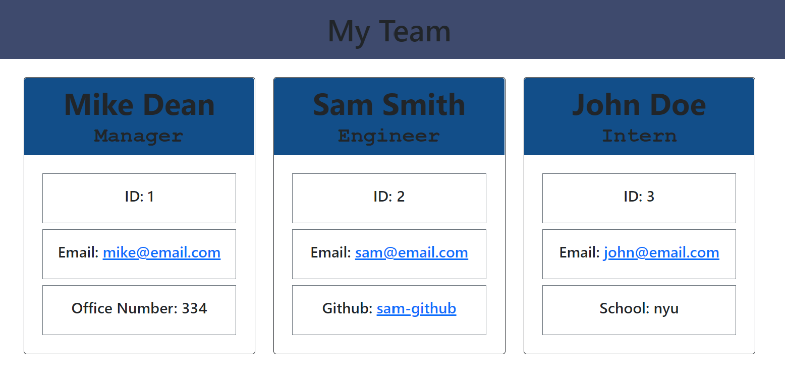

# Team Profile Generator 

Repo: https://github.com/c-phillips7/profile-generator

## Description 

A console based app that prompts a series of questions about the team members and their information. Once the user has finished responding, a HTML will auto-generate with bootstrap cards that list the team members.

## Table of Contents 

* [Installation](#installation)
* [Usage](#usage)
* [License](#license)
* [Contributing](#contributing)
* [Tests](#tests)
* [Questions](#questions)

## Installation

`npm install` to install all dependency, then `node index.js` to initialize the app.

## Usage

Prompt users with a series of questions to create a "team".

HTML with the team's profile is then generated using the answers.

A video demonstrating this can be found here:

https://www.youtube.com/watch?v=VzIGbZaj2eM

## License

No Licenses for this project!
## Contributing

No contribution information for this project!

## Tests

`npm run test` to use jest to test the classes and thier nested functions

## Questions

- Check out my other repositories at [GitHub Profile](https://github.com/c-phillips7)

- For any questions, contact me at cp.phillips15@gmail.com.